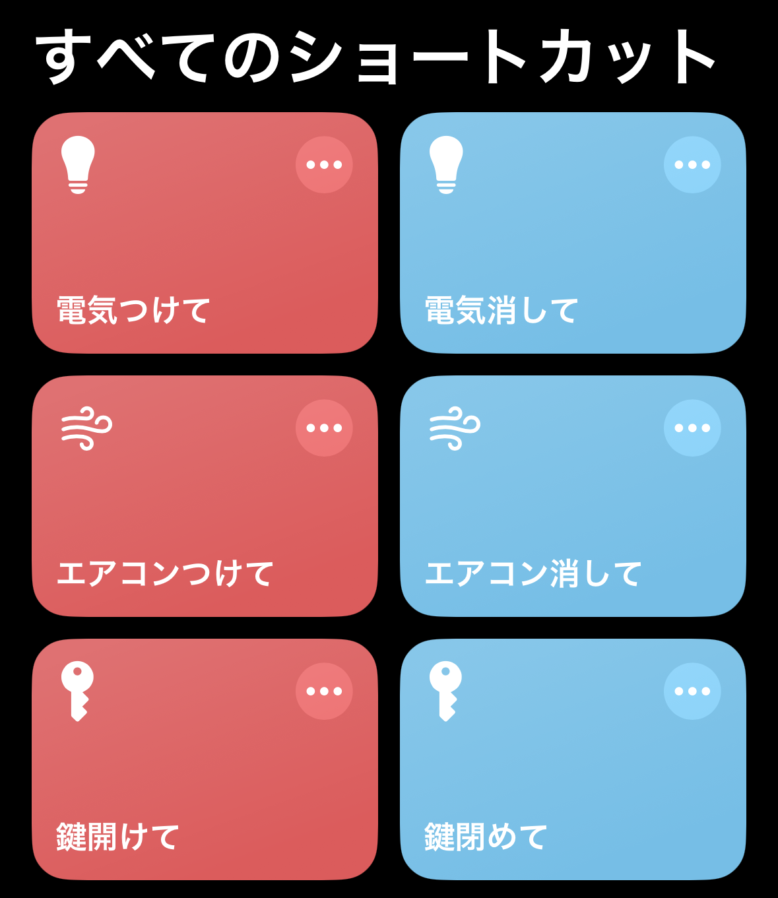

# Smart-Home

家電を操作するためのスマートスピーカーが欲しかったのですが、iPhone に Apple Intelligence が搭載されたため、iPhone から操作できるようにすれば今後も何かと便利そうだったので、iPhone から操作できるスマートホームを自作してみました。 \
今回は赤外線操作とデータベース管理の HOME ユニットと、鍵開閉操作の LOCK ユニットを作りました。

## 開発環境

- Raspberry Pi Zero 2 W
- Raspberry Pi Pico 2 W
- Ubuntu Server 24.04.2 LTS (64-bit)
- Docker 28.3.0
- Python 3.12.10
- Django 5.2.1
- PostgreSQL 17

## 技術スタック

### フロントエンド

- Django

### バックエンド

- Django
- PostgreSQL

## 構成

| ユニット名 | デバイス              | 接続機器                             |
| ---------- | --------------------- | ------------------------------------ |
| HOME       | Raspberry Pi Zero 2 W | BitTradeOne 赤外線リモコンアドバンス |
| LOCK       | Raspberry Pi Pico 2 W | Tower Pro Micro Servo Digital 9g     |

## HOME ユニット

### セットアップ

Django と PostgreSQL でホストサーバーを構築するとともに、BitTradeOne 赤外線リモコンアドバンスを用いて赤外線操作を行います。

```
curl -o setup.sh https://raw.githubusercontent.com/Yaaamashiro/smart-home/refs/heads/main/home/setup.sh
bash setup.sh
```

途中で Django と PostgreSQL の環境変数を `/smart-home/.env` に保存するため、DEBUG（Ture か False） と USERNAME と PASSWORD を入力する。

## LOCK ユニット

HOME ユニットのデータベースで、Lock テーブルの is_opened の値に応じてサーボモーターを回転させ、鍵開閉操作を行います。

LOCK ユニットのサーボモーターとサムターンの接続は、製作費の関係上、クリップと割り箸で無理矢理取り付けました。


Raspberry Pi Pico 2 W のメモリが非常に少ないため、`main.py` はリソース確保のために見やすさを犠牲にして書きました。

### セットアップ

`main.py` の `(SSID)` と `(PASSWORD)` に使用する Wi-Fi のそれぞれの項目を入力し、`(IP address)` に HOME ユニットのローカル IPv4 アドレスを入力して、Raspberry Pi Pico 2 W に書き込む。

## iPhone

ショートカットアプリから HOME ユニットにリクエストを送って操作します。

### セットアップ

`URLの内容を取得` を使用し、HTTP メソッドで HOME ユニットにリクエストを送り、各操作をします。


現在の Apple Intelligence ではパーソナライズ学習はできなさそうなので、「Hey Siri、○○」と命令したい場合、ショートカット名は"○○"にします。


### オートメーション

ショートカットのオートメーション機能を使って、外出時に施錠し、帰宅時に開錠するようにします。


## 参考文献

- [Django ドキュメント](https://docs.djangoproject.com/ja/5.2/ "Django ドキュメント | Django document")

- [Django アプリを Docker 化する方法: 初心者向けのステップバイステップガイド](https://www.docker.com/ja-jp/blog/how-to-dockerize-django-app/ "アプリを Docker 化する方法: 初心者向けのステップバイステップガイド | Docker")

- [Install Docker Engine on Ubuntu](https://docs.docker.com/engine/install/ubuntu/ "Ubuntu | Docker Docs")

- [USB 赤外線リモコンアドバンス・UNIX 系環境用コマンドライン操作ツール＆GUI 操作ツール Ver1.0.1](https://bit-trade-one.co.jp/assemblydeskfiles/hobby/ "ホビー | Bit Trade One, Ltd")
